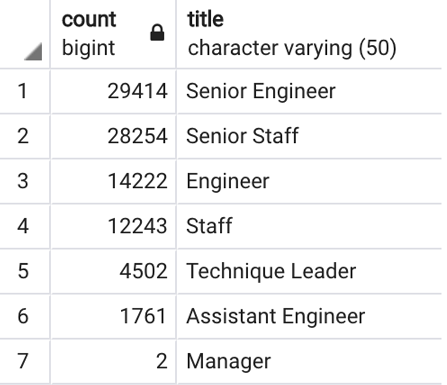

# Pewlett-Hackard-Analysis

## Overview of the Analysis
This project combined multiple personnel files from the Pewlett-Hackard company into a database for the purpose of analyzing retirement information.  The company wants to determine the number of retiring employees per title, and identify employees who are eligible to participate in a mentorship program.  The goal of the analysis is to help the company manage the 'silver tsunami' of aging employees reaching retirement age.

## Results
In this analysis, I created two .csv files:
### Retiring Titles
The [retiring_titles.csv](Analysis_Projects/Pewlett-Hackard-Analysis/Data/retiring_titles.csv) table holds the count of retiring employees by current job title.  
- Based on the image below, we can see that the majority of retiring staff menbers hold Senior-level job titles.
- The company's mentorship program should be targeting employees who are ready to advance into these senior-level roles.
- There are only two manager-role employees who are reaching retirement age, and almost 30,000 Senior Engineers.  Is that indicative of a lack of managerial support?  Or are managers generally younger employees who have been promoted?  
- It makes sense that the senior-level staff is generally made up of an older population of employees, but there may be value to keeping an employee in a role in which he/she is successful rather than 'moving them up'.

### Mentorship Eligibility
The [mentorship_eligibility.csv](Analysis_Projects/Pewlett-Hackard-Analysis/Data/mentorship_eligibility.csv) table holds the names and information of current employees that are eligible for the company's mentorship program.  

## Summary
- How many roles will need to be filled as the "silver tsunami" begins to make an impact?

There should be further analysis done to determine how many of the identified retirement candidates plan to retire at age 65.  We are currently looking at candidates born between 1952 and 1955, but could drill down further and see exactly how many employees could retire each year and set a Human Resources goal of recruiting that many qualified candidates to keep the workforce equilibrium.

- Are there enough qualified, retirement-ready employees in the departments to mentor the next generation of Pewlett Hackard employees?

There are 1,549 employees who have been identified as potential mentors.  The company will need to strategically design the mentorship program to take full advantage of the available mentor candidates.
